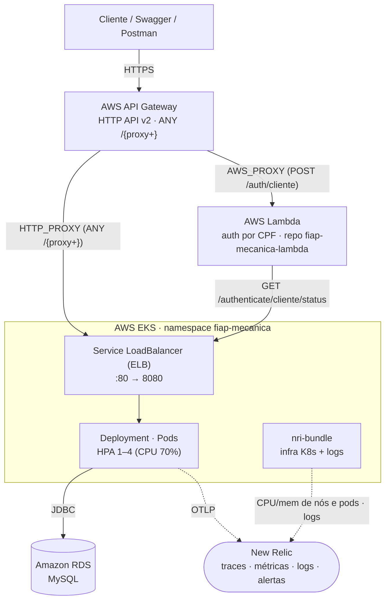

# Mecânica FIAP

API REST para gestão de uma oficina mecânica, desenvolvida como projeto acadêmico na FIAP. O sistema cobre o ciclo completo de uma ordem de serviço — da abertura ao diagnóstico, orçamento, aprovação, execução e entrega — com controle de estoque de peças e insumos e autenticação baseada em perfis de acesso.

Este é o repositório da **aplicação principal** (Fase 3): além do código da API, contém a infraestrutura específica da aplicação (ECR, API Gateway e alertas/dashboards New Relic) e o pipeline que builda, testa e faz o deploy no cluster Kubernetes. VPC/EKS, o banco gerenciado e a Function Lambda de autenticação vivem em [três repositórios separados](#estrutura-em-4-repositórios).

## Objetivos

- Gerenciar clientes, veículos, mecânicos e atendentes
- Controlar o ciclo de vida de ordens de serviço
- Gerenciar estoque de peças e insumos com baixa e devolução automática ao vincular/desvincular de ordens
- Restringir operações por perfil: administrador, atendente, mecânico e cliente

### Fase 3 — Objetivo desta etapa

Partindo da Fase 2 (Clean Architecture no código, containerização via Docker, orquestração no EKS, provisionamento com Terraform e CI/CD com deploy automático a cada merge na `main`), a Fase 3 adiciona:

- **API Gateway** (AWS HTTP API v2) como porta de entrada única, com URL estável e TLS.
- **Autenticação serverless por CPF**: uma AWS Lambda valida o CPF do cliente, confirma o cadastro na base de dados e devolve um JWT para consumo das rotas protegidas.
- **Observabilidade ponta a ponta** com New Relic: traces e métricas via OTLP, consumo de CPU/memória do cluster, healthchecks, alertas e dashboards de negócio.
- **Infraestrutura separada em 4 repositórios**, cada um com CI/CD próprio e deploy automático.

## Stack

**Aplicação**

- Java 25 · Spring Boot 4.0.5
- Spring Web MVC · Spring Security + JWT (Auth0 `java-jwt`)
- Spring Data JPA + Hibernate · Flyway · Lombok
- SpringDoc OpenAPI (Swagger UI)
- Micrometer + OpenTelemetry (exportação OTLP) · logs estruturados em JSON (formato ECS)
- Testcontainers · MySQL 8.4

**Plataforma**

- Docker · Kubernetes (AWS EKS) com HorizontalPodAutoscaler
- AWS API Gateway (HTTP API v2) · AWS Lambda (Node.js + TypeScript — repositório `fiap-mecanica-lambda`)
- Amazon RDS for MySQL
- Terraform (um root module por repositório de infra)
- New Relic (APM via OTLP, integração Kubernetes `nri-bundle`, alertas e dashboards)
- GitHub Actions (CI/CD)

## Arquitetura de runtime



A aplicação é um **monolito modular** organizado segundo os princípios da **Clean Architecture**. Cada módulo de negócio é dividido em duas camadas, com uma regra de dependência única: **as dependências apontam sempre para dentro**, em direção ao domínio — nunca o contrário.

- **`core/` (domínio)** — regras de negócio em Java puro, sem nenhuma dependência de Spring, JPA ou HTTP. Concentra as entidades de domínio, os *use cases* (casos de uso), os DTOs e as **interfaces de gateway**. É o coração do sistema e não conhece frameworks nem banco de dados.
- **`infra/` (infraestrutura)** — os detalhes que servem ao domínio: controllers HTTP, implementações dos gateways (persistência JPA), entidades de banco, segurança e serialização. Depende do `core`, jamais o inverso.

### Módulos de negócio

| Módulo | Responsabilidade |
|---|---|
| `gestao` | Clientes, veículos, mecânicos e atendentes |
| `estoque` | Peças e insumos, com baixa e devolução automática de estoque |
| `ordemdeservico` | Ciclo de vida da ordem de serviço, serviços, orçamento e notificações |
| `shared` | Segurança/JWT, tratamento global de exceções, *value objects*, paginação, notificação e métricas |

## Estrutura em 4 repositórios

A Fase 3 exige a infraestrutura dividida em quatro repositórios, cada um com CI/CD independente e deploy automático no push para a `main`.

| Repositório | O que contém |
|---|---|
| **`fiap-mecanica`** (este) | Código da aplicação + `infra/terraform/app-infra` (ECR), `infra/terraform/apigateway` (API Gateway), `infra/terraform/aws` (alertas + dashboards New Relic). Pipeline de build, deploy no EKS e apply desses módulos. |
| **`fiap-mecanica-infra-k8s`** | VPC, subnets, cluster EKS + node group e os add-ons de cluster (metrics-server, `nri-bundle` da New Relic). |
| **`fiap-mecanica-infra-db`** | Amazon RDS for MySQL — instância, subnet group e security group. |
| **`fiap-mecanica-lambda`** | Function Lambda de autenticação de cliente por CPF (Node.js + TypeScript) + seu Terraform. |

**Dependência entre os states Terraform** (leitura via `terraform_remote_state` — mesmo bucket S3, chaves distintas):

```
infra-k8s  ◄──  infra-db  ◄──  app-infra / apigateway
                               lambda (state próprio, independente)
```

**Ordem de deploy numa infra do zero:** `infra-k8s` → `infra-db` → `lambda` → `fiap-mecanica`, esperando cada CD ficar verde antes do próximo. Como a Lambda já está no ar quando o `fiap-mecanica` roda, a rota `POST /auth/cliente` é criada na primeira passada. Não há gatilho automático entre os repositórios — cada CD dispara no push da própria `main`. (Só é preciso re-executar o CD do `fiap-mecanica` se ele rodar **antes** de a Lambda existir — o job `apigw-apply` detecta e avisa.)

## Autenticação

Duas formas de obter um token JWT (HS256):

**Funcionário** — `POST /authenticate/login` com `{ "cpf": "...", "password": "..." }`. A própria aplicação valida e assina o token com o perfil correspondente (`ROLE_ADMINISTRADOR`, `ROLE_ATENDENTE` ou `ROLE_MECANICO`).

**Cliente (Fase 3)** — `POST /auth/cliente` (pelo API Gateway) com `{ "cpf": "..." }`. O gateway encaminha para a Lambda, que:

1. valida o formato do CPF;
2. chama `GET /authenticate/cliente/status?cpf=...` na aplicação, que confirma que o CPF pertence a um cliente cadastrado e cria um `User` com `ROLE_CLIENTE` na primeira vez;
3. assina o JWT (HS256, segredo compartilhado com a aplicação, `sub` = id do usuário).

O token vai no header `Authorization: Bearer <token>` nas demais requisições. O token de cliente dá acesso a `GET /ordem-servico/minhas-ordens`.

O gateway apenas **roteia** (`ANY /{proxy+}` → ELB via `HTTP_PROXY`, header `Authorization` repassado intacto); a autorização por rota e perfil continua inteiramente na aplicação (`SecurityConfiguration` + `UserAuthenticationFilter`). Os trade-offs desta estratégia serão registrados em [`docs/`](docs/).

## Observabilidade

- **Traces e métricas** da aplicação são exportados via **OTLP** para a New Relic (Micrometer + OpenTelemetry). Métricas de negócio: `os.criadas`, `os.duracao{fase}`.
- **Consumo do cluster** (CPU/memória de nós e pods) e **logs** chegam pela integração Kubernetes da New Relic (`nri-bundle`), instalada pelo CD do `fiap-mecanica-infra-k8s`.
- **Logs estruturados em JSON** (formato ECS), com `trace.id` / `span.id` para correlação com os traces.
- **Dashboards** (Terraform, `infra/terraform/aws/newrelic-dashboards.tf`):
  - *Observabilidade de Negócio* — volume diário de OS, tempo médio por fase (diagnóstico / execução / entrega), taxa de erro, erros por rota, falhas de acesso ao banco.
  - *Performance e Disponibilidade* — latência das APIs (p50/p90/p95/p99), uptime do healthcheck, CPU/memória dos pods.
- **Alertas** (`infra/terraform/aws/newrelic-alerts.tf`) → e-mail: 5xx em rotas `/ordem-servico/**` e healthcheck do `/actuator/health` falhando.

## Rodando localmente

### Pré-requisitos

| Pré-requisito |
|---|
| Docker + Docker Compose |

### Clone do repositório

Realize o clone do repositório em sua máquina local.

```
git clone https://github.com/ArthurPeruzzo/fiap-mecanica.git
```

### Configuração de variáveis de ambiente

O `docker-compose.yml` não traz credenciais nem o `JWT_SECRET` fixos no arquivo — eles vêm de um arquivo `.env` local, que **não é versionado** (está no `.gitignore`). Antes do primeiro `docker compose up`, copie o template:

```
cp .env.example .env
```

O `.env.example` já traz valores padrão (`root`/`root`) suficientes para rodar localmente sem nenhum ajuste.

| Variável | Descrição |
|---|---|
| `DB_ROOT_PASSWORD` | Senha do usuário `root` do MySQL (container `db`) |
| `DB_USERNAME` | Usuário usado pela aplicação para conectar ao banco |
| `DB_PASSWORD` | Senha usada pela aplicação para conectar ao banco |
| `JWT_SECRET` | Chave usada para assinar/validar os tokens JWT. Deve ser uma string Base64URL com no mínimo 32 bytes decodificados |

> O Docker Compose carrega o `.env` automaticamente por estar no mesmo diretório do `docker-compose.yml` — não é preciso passar nenhuma flag adicional.

### Docker Compose

Sobe a aplicação e o banco de dados juntos, sem necessidade de instalar Java ou MySQL localmente.

```
# Comando utilizado para subir a aplicação
docker compose up
```

A aplicação ficará disponível em `http://localhost:8080`.

O MySQL ficará acessível no host em `localhost:3307` (útil para conectar com DBeaver ou outro cliente SQL). Com os valores padrão do `.env.example`:

| Campo | Valor |
|---|---|
| Host | `127.0.0.1` |
| Porta | `3307` |
| Usuário | `root` |
| Senha | `root` (`DB_ROOT_PASSWORD` no `.env`) |
| Database | `mecanica` |

Para parar:

```
docker compose down        # mantém os dados do banco
docker compose down -v     # apaga os dados do banco também
```

As migrations do Flyway rodam automaticamente na inicialização e criam todas as tabelas.

## Deploy

**Produção — automático.** Cada `pull request` para a `main` de qualquer um dos 4 repositórios dispara o **CI** (`ci.yml`: build + testes + `terraform plan`, sem aplicar nada). O merge dispara o **CD** (`cd.yml`), que faz o deploy na AWS. A branch `main` é protegida — merge só via pull request.

CD deste repositório, na ordem de execução:

| Job | O que faz |
|---|---|
| `app-infra-apply` | `terraform apply` de `infra/terraform/app-infra` — cria o ECR; lê `db_endpoint` e `eks_cluster_name` dos outros repositórios via `terraform_remote_state`. |
| `docker-build-push` | Builda a imagem versionada (versão do `pom.xml`) e publica no ECR. Falha se a tag já existir — faça o bump da versão antes do merge. |
| `newrelic-apply` | `terraform apply` de `infra/terraform/aws` — alertas e dashboards New Relic; descobre a URL do API Gateway para o monitor de uptime. |
| `k8s-deploy` | `kubectl apply` de namespace/secret/configmap/deployment/service/hpa, `kubectl set image` com a versão publicada e aguarda o rollout. Gera o ConfigMap com o `DB_URL` real (endpoint do RDS lido do job anterior). |
| `apigw-apply` | `terraform apply` de `infra/terraform/apigateway` — roda por último porque a integração `HTTP_PROXY` precisa do hostname do ELB, criado no `k8s-deploy`. Habilita a rota `POST /auth/cliente` se a Lambda já existir. |

**Deploy manual / infra do zero:** ver os READMEs específicos — [`k8s/README.md`](k8s/README.md), [`infra/terraform/app-infra/README.md`](infra/terraform/app-infra/README.md), [`infra/terraform/apigateway/README.md`](infra/terraform/apigateway/README.md), [`infra/terraform/aws/README.md`](infra/terraform/aws/README.md) — e os repositórios `fiap-mecanica-infra-k8s`, `fiap-mecanica-infra-db` e `fiap-mecanica-lambda`.

**GitHub Secrets** (por repositório): credenciais AWS (`AWS_ACCESS_KEY_ID`, `AWS_SECRET_ACCESS_KEY`, `AWS_SESSION_TOKEN` — temporárias, rotacionam a cada sessão), além de `JWT_SECRET`, `NEW_RELIC_*` e `TF_VAR_DB_*` conforme o repo. O script `scripts/refresh-aws-secrets.sh` (na raiz do workspace) publica os secrets nos 4 repositórios de uma vez.

## Usuários padrão

Funcionários criados automaticamente pelas migrations do Flyway. Todos compartilham a mesma senha:

| CPF | Senha | Perfil |
|---|---|---|
| `22255588846` | `MeCanica2026!@#` | Administrador |
| `33366699957` | `MeCanica2026!@#` | Atendente |
| `11144477735` | `MeCanica2026!@#` | Mecânico |

Use o token retornado no header `Authorization: Bearer <token>` nas demais requisições.

**Clientes** não têm senha — autenticam por CPF via `POST /auth/cliente` (ver [Autenticação](#autenticação)). Os dados de exemplo incluem o cliente de CPF `65997627004`.

## Dados de exemplo

A migration `V14` carrega um conjunto de dados iniciais com clientes, veículos, peças, insumos, serviços e ordens de serviço em todos os status possíveis, prontos para exploração imediata da API.

## Documentação da API

Swagger UI, gerado automaticamente via SpringDoc OpenAPI.

- **Local:** `http://localhost:8080/swagger-ui.html`
- **Produção:** a porta de entrada é o **API Gateway**, com URL estável entre deploys. Descubra a URL atual com:

  ```bash
  cd infra/terraform/apigateway && terraform output -raw api_gateway_url
  # → https://<id>.execute-api.us-east-1.amazonaws.com  (acrescente /swagger-ui.html)
  ```

  Ela também aparece no resumo (*Summary*) da run do CD. Alternativa direta pelo ELB — o hostname muda a cada recriação do Service:

  ```bash
  echo "http://$(kubectl get svc fiap-mecanica -n fiap-mecanica -o jsonpath='{.status.loadBalancer.ingress[0].hostname}')/swagger-ui.html"
  ```

## Testes

Os testes de integração usam Testcontainers e requerem Docker em execução.

## Documentação da Arquitetura

A documentação arquitetural da Fase 3 — diagramas de componentes e de sequência, RFCs, ADRs, justificativa da escolha do banco e modelo de dados (ER) — fica em [`docs/`](docs/).

## Linguagem Ubíqua

Dicionário de termos do domínio utilizados no sistema.

### Atores e entidades

| Termo | Definição |
|---|---|
| **Cliente** | Pessoa física (CPF) ou jurídica (CNPJ) proprietária de veículos cadastrados no sistema. |
| **Veículo** | Automóvel pertencente a um cliente, identificado pela placa. Um veículo não pode ter mais de uma ordem de serviço ativa simultaneamente. |
| **Atendente** | Funcionário responsável por abrir ordens de serviço, enviar orçamentos ao cliente, registrar a aprovação ou recusa e realizar a entrega do veículo. |
| **Mecânico** | Funcionário responsável por executar o diagnóstico e os serviços vinculados a uma ordem. O mecânico que inicia o diagnóstico torna-se o **mecânico responsável** por aquela ordem. |
| **Administrador** | Perfil com acesso irrestrito ao cadastro de clientes, veículos, peças, insumos e serviços. Não opera ordens de serviço diretamente. |

### Estoque

| Termo | Definição |
|---|---|
| **Peça** | Item físico de estoque. Ex: pastilha de freio, correia dentada. |
| **Insumo** | Item consumível de estoque com unidade de medida variável (litros, ml, unidades). Ex: óleo de motor, fluido de freio. |
| **Baixa de Estoque** | Redução da quantidade disponível de uma peça ou insumo ao vinculá-la a uma ordem em diagnóstico. |
| **Devolução de Estoque** | Restituição da quantidade ao estoque ao desvincular uma peça ou insumo de uma ordem. |
| **Estoque Insuficiente** | Condição que impede o vínculo quando a quantidade solicitada supera o disponível. |

### Ordem de Serviço

| Termo | Definição                                                                                                                            |
|---|--------------------------------------------------------------------------------------------------------------------------------------|
| **Ordem de Serviço** | Registro central do ciclo de atendimento de um veículo, desde a recepção até a entrega. Agrega serviços, peças e insumos vinculados. |
| **Diagnóstico** | Fase em que o mecânico responsável inspeciona o veículo e determina quais serviços, peças e insumos serão necessários.               |
| **Orçamento** | Valor total calculado ao concluir o diagnóstico, somando os preços de todos os serviços, peças e insumos vinculados naquele momento. |
| **Vínculo** | Associação de um serviço, peça ou insumo a uma ordem de serviço. A vinculação é permitida durante a criação da ordem (**Recebida**) e durante o diagnóstico (**Em Diagnóstico**). A desvinculação de peças e insumos é permitida somente durante o diagnóstico. |
| **Mecânico Responsável** | O mecânico que iniciou o diagnóstico de uma ordem de serviço. Somente ele pode continuar as operações daquela ordem.                               |
| **Link de Aprovação de Orçamento** | Token UUID gerado ao enviar o orçamento ao cliente. Tem validade de 3 dias e uso único. O cliente utiliza o link para aprovar ou recusar o orçamento sem necessidade de autenticação, desde que a ordem esteja em **Aguardando Aprovação**. |
| **Aprovação/Recusa pelo Atendente** | O atendente pode registrar a decisão do cliente diretamente pelo sistema, sem uso do link, desde que a ordem esteja em **Aguardando Aprovação**. |

### Ciclo de vida da Ordem de Serviço

| Status | Significado |
|---|---|
| **Recebida** | Ordem de Serviço criada pelo atendente. Aguardando que um mecânico inicie o diagnóstico. |
| **Em Diagnóstico** | Diagnóstico iniciado pelo mecânico responsável. Permite vincular serviços, peças e insumos. |
| **Diagnóstico Concluído** | Diagnóstico encerrado e orçamento calculado. Aguarda envio ao cliente. |
| **Aguardando Aprovação** | Orçamento enviado ao cliente via notificação com link de aprovação. O cliente ou o atendente registram a decisão. |
| **Em Execução** (Ordem de Serviço) | Orçamento aprovado. Os serviços vinculados podem ser iniciados e finalizados individualmente pelo mecânico. |
| **Finalizada** | Todos os serviços vinculados foram concluídos. Aguarda entrega do veículo. |
| **Entregue** | Veículo devolvido ao cliente. Estado terminal positivo. |
| **Cancelada** | Orçamento recusado pelo cliente. Estado terminal negativo. Estoque devolvido automaticamente. |

### Execução de serviços

> Os status de serviço são independentes do status da Ordem de Serviço. Uma Ordem de Serviço pode estar **Em Execução** enquanto cada serviço vinculado evolui individualmente entre os estados abaixo.

| Termo | Definição |
|---|---|
| **Serviço** | Atividade catalogada que pode ser executada pela oficina, com preço e descrição definidos. Ex: alinhamento, troca de óleo. |
| **Serviço Vinculado** | Instância de um serviço associada a uma Ordem de Serviço específica, com preço e status de execução próprios. |
| **Não Iniciado** (serviço) | Serviço vinculado à Ordem de Serviço mas ainda não iniciado pelo mecânico. |
| **Em Execução** (serviço) | Serviço em andamento pelo mecânico responsável. |
| **Finalizado** (serviço) | Serviço concluído. Quando todos os serviços vinculados atingem este status, a Ordem de Serviço transita automaticamente para **Finalizada**. |
| **Tempo Médio de Execução** | Média das durações de todos os serviços finalizados de uma Ordem de Serviço. Ausente quando nenhum serviço foi concluído. |
