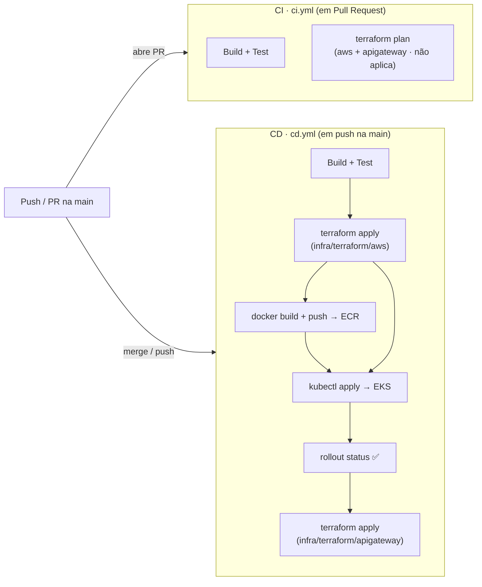

# Mecânica FIAP

API REST para gestão de uma oficina mecânica, desenvolvida como projeto acadêmico na FIAP. O sistema cobre o ciclo completo de uma ordem de serviço — da abertura ao diagnóstico, orçamento, aprovação, execução e entrega — com controle de estoque de peças e insumos e autenticação baseada em perfis de acesso.

## Objetivos

- Gerenciar clientes, veículos, mecânicos e atendentes
- Controlar o ciclo de vida de ordens de serviço
- Gerenciar estoque de peças e insumos com baixa e devolução automática ao vincular/desvincular de ordens
- Restringir operações por perfil: administrador, atendente e mecânico

### Fase 2 — Objetivo desta etapa

Esta fase leva a aplicação a um ambiente produtivo real na AWS. Além de aplicar **Clean Architecture** no código — com separação estrita entre o núcleo de negócio (`core`) e os detalhes de framework, persistência e HTTP (`infra`), o que protege as regras de negócio e facilita testes e evolução —, a etapa entrega a operação da aplicação em produção: containerização via Docker, orquestração no Kubernetes (EKS), provisionamento de infraestrutura como código com Terraform e uma pipeline de CI/CD que builda, testa, publica a imagem e faz o deploy automaticamente a cada merge na `main`.

## Stack

- Java 25
- Spring Boot 4.0.5
- Spring Web MVC
- Spring Security + JWT (Auth0 `java-jwt`)
- Spring Data JPA + Hibernate
- Flyway
- Lombok
- SpringDoc OpenAPI (Swagger UI)
- Testcontainers
- MySQL 8.4

## Arquitetura

A aplicação é um **monolito modular** organizado segundo os princípios da **Clean Architecture**. Cada módulo de negócio é dividido em duas camadas, com uma regra de dependência única: **as dependências apontam sempre para dentro**, em direção ao domínio — nunca o contrário.

- **`core/` (domínio)** — regras de negócio em Java puro, sem nenhuma dependência de Spring, JPA ou HTTP. Concentra as entidades de domínio, os *use cases* (casos de uso), os DTOs e as **interfaces de gateway**. É o coração do sistema e não conhece frameworks nem banco de dados.
- **`infra/` (infraestrutura)** — os detalhes que servem ao domínio: controllers HTTP, implementações dos gateways (persistência JPA), entidades de banco, segurança e serialização. Depende do `core`, jamais o inverso.

#### Módulos de negócio

| Módulo | Responsabilidade |
|---|---|
| `gestao` | Clientes, veículos, mecânicos e atendentes |
| `estoque` | Peças e insumos, com baixa e devolução automática de estoque |
| `ordemdeservico` | Ciclo de vida da ordem de serviço, serviços, orçamento e notificações |
| `shared` | Segurança/JWT, tratamento global de exceções, *value objects*, paginação e notificação |

### Fluxo de deploy (CI/CD)



Toda `pull request` para a `main` dispara o **CI** (`.github/workflows/ci.yml`): compila, roda os testes automatizados e mostra o que o Terraform mudaria (`terraform plan` nos dois root modules), sem aplicar nada. Ao dar merge, o **CD** (`.github/workflows/cd.yml`) builda e publica a imagem versionada no ECR, aplica a infraestrutura (`terraform apply`) e faz o deploy no cluster (`kubectl apply` dos manifestos + `kubectl set image` com a versão publicada + `kubectl rollout status`). Por último, o job `apigw-apply` aplica o **API Gateway** — ele roda no fim porque a integração precisa do hostname do LoadBalancer, que só existe depois do deploy no cluster. Detalhes de cada job em [`k8s/README.md`](k8s/README.md), [`infra/terraform/aws/README.md`](infra/terraform/aws/README.md) e [`infra/terraform/apigateway/README.md`](infra/terraform/apigateway/README.md).

### Porta de entrada — API Gateway

Em produção o acesso à API passa por um **AWS API Gateway (HTTP API v2)**, provisionado em [`infra/terraform/apigateway`](infra/terraform/apigateway/README.md). Ele publica uma URL estável e com TLS (`https://<id>.execute-api.us-east-1.amazonaws.com`) e encaminha todo o tráfego (`ANY /{proxy+}`, integração `HTTP_PROXY`) para o LoadBalancer do Service no EKS — cujo hostname é gerado pela AWS e muda a cada recriação, o que o pipeline resolve automaticamente.

O gateway apenas **roteia**: a autenticação e a autorização continuam inteiramente na aplicação (`UserAuthenticationFilter` + `SecurityConfiguration`), e o header `Authorization` é repassado intacto. O stage é `$default`, sem prefixo de path, para que os matchers de rota do Spring Security continuem válidos. O módulo já está preparado para receber a Function Lambda de autenticação de cliente da Fase 3 como uma rota adicional (`POST /auth/cliente`), sem acoplamento: enquanto a variável `auth_lambda_name` estiver vazia, nada da Lambda é avaliado.

---

## Rodando localmente

### Pré-requisitos

| Pré-requisito |
|---|
| Docker + Docker Compose |

---

### Clone do repositório

Realize o clone do repositório em sua máquina local.

```
git clone https://github.com/ArthurPeruzzo/fiap-mecanica.git
```

### Configuração de variáveis de ambiente

O `docker-compose.yml` não traz credenciais nem o `JWT_SECRET` fixos no arquivo — eles vêm de um arquivo `.env` local, que **não é versionado** (está no `.gitignore`). Antes do primeiro `docker compose up`, copie o template:

```
cp .env.example .env
```

O `.env.example` já traz valores padrão (`root`/`root`) suficientes para rodar localmente sem nenhum ajuste.

| Variável | Descrição |
|---|---|
| `DB_ROOT_PASSWORD` | Senha do usuário `root` do MySQL (container `db`) |
| `DB_USERNAME` | Usuário usado pela aplicação para conectar ao banco |
| `DB_PASSWORD` | Senha usada pela aplicação para conectar ao banco |
| `JWT_SECRET` | Chave usada para assinar/validar os tokens JWT. Deve ser uma string Base64URL com no mínimo 32 bytes decodificados |

> O Docker Compose carrega o `.env` automaticamente por estar no mesmo diretório do `docker-compose.yml` — não é preciso passar nenhuma flag adicional.

### Docker Compose

Sobe a aplicação e o banco de dados juntos, sem necessidade de instalar Java ou MySQL localmente.

```
# Comando utilizado para subir a aplicação
docker compose up
```

A aplicação ficará disponível em `http://localhost:8080`.

O MySQL ficará acessível no host em `localhost:3307` (útil para conectar com DBeaver ou outro cliente SQL). Com os valores padrão do `.env.example`:

| Campo | Valor |
|---|---|
| Host | `127.0.0.1` |
| Porta | `3307` |
| Usuário | `root` |
| Senha | `root` (`DB_ROOT_PASSWORD` no `.env`) |
| Database | `mecanica` |

Para parar:

```
docker compose down        # mantém os dados do banco
docker compose down -v     # apaga os dados do banco também
```

As migrations do Flyway rodam automaticamente na inicialização e criam todas as tabelas.

---

## Deploy em Kubernetes

Assume um cluster EKS e um RDS já provisionados (ver seção Terraform abaixo). Resumo dos comandos essenciais:

```bash
aws eks update-kubeconfig --name eks-fiap-mecanica --region us-east-1

cp k8s/secret.yaml.example k8s/secret.yaml   # preencher com credenciais reais, nunca commitar

kubectl apply -f k8s/namespace.yaml
kubectl apply -f k8s/metrics-server.yaml
kubectl apply -f k8s/configmap.yaml -f k8s/secret.yaml
kubectl apply -f k8s/deployment.yaml
kubectl apply -f k8s/service.yaml
kubectl apply -f k8s/hpa.yaml
```

Guia completo (build/push da imagem, ordem de apply, ciclo de teste rápido, Metrics Server, troubleshooting) em [`k8s/README.md`](k8s/README.md).

## Provisionamento da infraestrutura com Terraform

```bash
cd infra/terraform/aws
terraform init
terraform apply -var db_username=<usuario> -var db_password=<senha>
```

Provisiona VPC, cluster EKS, RDS MySQL e repositório ECR na AWS. Lista completa de recursos criados, variáveis, outputs e o passo de bootstrap do backend remoto em [`infra/terraform/aws/README.md`](infra/terraform/aws/README.md).

---

## Usuários padrão

Criados automaticamente pelas migrations do Flyway. Todos compartilham a mesma senha:

| CPF | Senha | Perfil |
|---|---|---|
| `22255588846` | `MeCanica2026!@#` | Administrador |
| `33366699957` | `MeCanica2026!@#` | Atendente |
| `11144477735` | `MeCanica2026!@#` | Mecânico |

Use o token retornado no header `Authorization: Bearer <token>` nas demais requisições.

---

## Dados de exemplo

A migration `V14` carrega um conjunto de dados iniciais com clientes, veículos, peças, insumos, serviços e ordens de serviço em todos os status possíveis, prontos para exploração imediata da API.

---

## Documentação da API

Swagger UI, gerado automaticamente via SpringDoc OpenAPI. Em ambiente local o endereço é fixo:

`http://localhost:8080/swagger-ui.html`

**Ambiente deployado (AWS):** não há um endereço fixo. O `Service` do tipo `LoadBalancer` recebe um hostname atribuído dinamicamente pela AWS (ex.: `...elb.amazonaws.com`), e como o projeto não usa um DNS próprio, **esse hostname muda a cada recriação do Service** (ou da infra). Por isso não faz sentido versionar a URL aqui — descubra a atual com:

```bash
echo "http://$(kubectl get svc fiap-mecanica -n fiap-mecanica -o jsonpath='{.status.loadBalancer.ingress[0].hostname}')/swagger-ui.html"
```

---

## Testes
Os testes de integração usam Testcontainers e requerem Docker em execução.

---

## Linguagem Ubíqua

Dicionário de termos do domínio utilizados no sistema.

### Atores e entidades

| Termo | Definição |
|---|---|
| **Cliente** | Pessoa física (CPF) ou jurídica (CNPJ) proprietária de veículos cadastrados no sistema. |
| **Veículo** | Automóvel pertencente a um cliente, identificado pela placa. Um veículo não pode ter mais de uma ordem de serviço ativa simultaneamente. |
| **Atendente** | Funcionário responsável por abrir ordens de serviço, enviar orçamentos ao cliente, registrar a aprovação ou recusa e realizar a entrega do veículo. |
| **Mecânico** | Funcionário responsável por executar o diagnóstico e os serviços vinculados a uma ordem. O mecânico que inicia o diagnóstico torna-se o **mecânico responsável** por aquela ordem. |
| **Administrador** | Perfil com acesso irrestrito ao cadastro de clientes, veículos, peças, insumos e serviços. Não opera ordens de serviço diretamente. |

### Estoque

| Termo | Definição |
|---|---|
| **Peça** | Item físico de estoque. Ex: pastilha de freio, correia dentada. |
| **Insumo** | Item consumível de estoque com unidade de medida variável (litros, ml, unidades). Ex: óleo de motor, fluido de freio. |
| **Baixa de Estoque** | Redução da quantidade disponível de uma peça ou insumo ao vinculá-la a uma ordem em diagnóstico. |
| **Devolução de Estoque** | Restituição da quantidade ao estoque ao desvincular uma peça ou insumo de uma ordem. |
| **Estoque Insuficiente** | Condição que impede o vínculo quando a quantidade solicitada supera o disponível. |

### Ordem de Serviço

| Termo | Definição                                                                                                                            |
|---|--------------------------------------------------------------------------------------------------------------------------------------|
| **Ordem de Serviço** | Registro central do ciclo de atendimento de um veículo, desde a recepção até a entrega. Agrega serviços, peças e insumos vinculados. |
| **Diagnóstico** | Fase em que o mecânico responsável inspeciona o veículo e determina quais serviços, peças e insumos serão necessários.               |
| **Orçamento** | Valor total calculado ao concluir o diagnóstico, somando os preços de todos os serviços, peças e insumos vinculados naquele momento. |
| **Vínculo** | Associação de um serviço, peça ou insumo a uma ordem de serviço. A vinculação é permitida durante a criação da ordem (**Recebida**) e durante o diagnóstico (**Em Diagnóstico**). A desvinculação de peças e insumos é permitida somente durante o diagnóstico. |
| **Mecânico Responsável** | O mecânico que iniciou o diagnóstico de uma ordem de serviço. Somente ele pode continuar as operações daquela ordem.                               |
| **Link de Aprovação de Orçamento** | Token UUID gerado ao enviar o orçamento ao cliente. Tem validade de 3 dias e uso único. O cliente utiliza o link para aprovar ou recusar o orçamento sem necessidade de autenticação, desde que a ordem esteja em **Aguardando Aprovação**. |
| **Aprovação/Recusa pelo Atendente** | O atendente pode registrar a decisão do cliente diretamente pelo sistema, sem uso do link, desde que a ordem esteja em **Aguardando Aprovação**. |

### Ciclo de vida da Ordem de Serviço

| Status | Significado |
|---|---|
| **Recebida** | Ordem de Serviço criada pelo atendente. Aguardando que um mecânico inicie o diagnóstico. |
| **Em Diagnóstico** | Diagnóstico iniciado pelo mecânico responsável. Permite vincular serviços, peças e insumos. |
| **Diagnóstico Concluído** | Diagnóstico encerrado e orçamento calculado. Aguarda envio ao cliente. |
| **Aguardando Aprovação** | Orçamento enviado ao cliente via notificação com link de aprovação. O cliente ou o atendente registram a decisão. |
| **Em Execução** (Ordem de Serviço) | Orçamento aprovado. Os serviços vinculados podem ser iniciados e finalizados individualmente pelo mecânico. |
| **Finalizada** | Todos os serviços vinculados foram concluídos. Aguarda entrega do veículo. |
| **Entregue** | Veículo devolvido ao cliente. Estado terminal positivo. |
| **Cancelada** | Orçamento recusado pelo cliente. Estado terminal negativo. Estoque devolvido automaticamente. |

### Execução de serviços

> Os status de serviço são independentes do status da Ordem de Serviço. Uma Ordem de Serviço pode estar **Em Execução** enquanto cada serviço vinculado evolui individualmente entre os estados abaixo.

| Termo | Definição |
|---|---|
| **Serviço** | Atividade catalogada que pode ser executada pela oficina, com preço e descrição definidos. Ex: alinhamento, troca de óleo. |
| **Serviço Vinculado** | Instância de um serviço associada a uma Ordem de Serviço específica, com preço e status de execução próprios. |
| **Não Iniciado** (serviço) | Serviço vinculado à Ordem de Serviço mas ainda não iniciado pelo mecânico. |
| **Em Execução** (serviço) | Serviço em andamento pelo mecânico responsável. |
| **Finalizado** (serviço) | Serviço concluído. Quando todos os serviços vinculados atingem este status, a Ordem de Serviço transita automaticamente para **Finalizada**. |
| **Tempo Médio de Execução** | Média das durações de todos os serviços finalizados de uma Ordem de Serviço. Ausente quando nenhum serviço foi concluído. |
