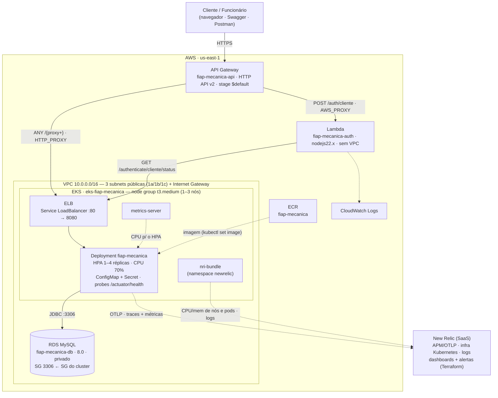
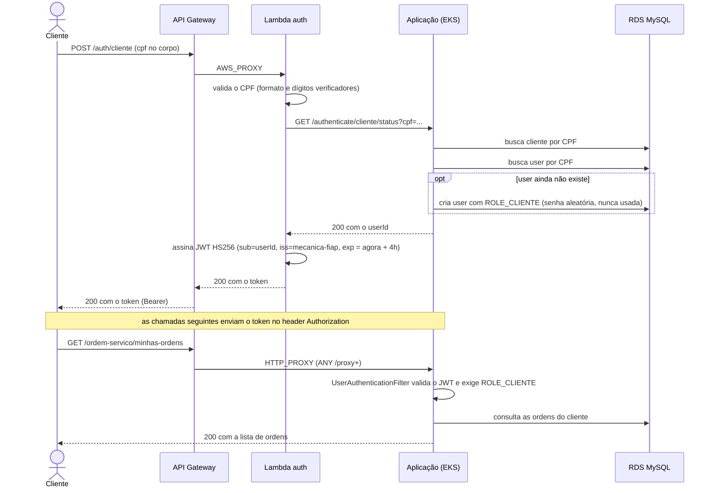
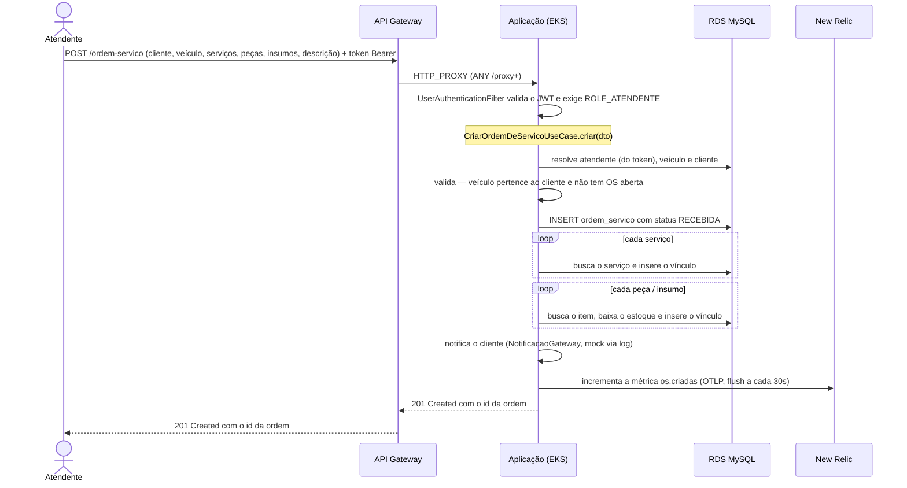

# Arquitetura — Mecânica FIAP

Visão de componentes da solução implantada na AWS: a API principal em Kubernetes, a Function
Lambda de autenticação, o API Gateway como porta de entrada, o banco gerenciado e a stack de
observabilidade. Todos os recursos são provisionados com Terraform, distribuídos nos
[4 repositórios](../README.md#estrutura-em-4-repositórios).

## Diagrama de Componentes

## Legenda de componentes

| Componente | O que é | Provisionado por |
|---|---|---|
| **API Gateway** (`fiap-mecanica-api`) | HTTP API v2, stage `$default`. Porta de entrada única, com URL estável e TLS. Rota `ANY /{proxy+}` → ELB (`HTTP_PROXY`); rota `POST /auth/cliente` → Lambda (`AWS_PROXY`) + `aws_lambda_permission`. Só roteia — não autentica. | `fiap-mecanica/infra/terraform/apigateway` |
| **Lambda** (`fiap-mecanica-auth`) | Function serverless (`nodejs22.x`, 256 MB, timeout 25s, **sem `vpc_config`** — precisa alcançar o ELB público). Valida o CPF, confirma o cliente chamando a aplicação e assina um JWT HS256. | `fiap-mecanica-lambda/infra/terraform/aws` |
| **ELB** | Load balancer criado pelo `Service` do tipo `LoadBalancer` (`:80` → `:8080`). Alvo da integração `HTTP_PROXY` do gateway; hostname muda a cada recriação (o CD descobre em runtime). | `fiap-mecanica/k8s/service.yaml` |
| **Pods / Deployment** | A aplicação Spring Boot. Imagem vinda do ECR; config via `envFrom` (ConfigMap + Secret); probes de liveness/readiness no Actuator. Escala por HPA (1–4 réplicas, CPU 70%). | `fiap-mecanica/k8s/*.yaml` + `cd.yml` (gera ConfigMap/Secret) |
| **EKS** (`eks-fiap-mecanica`) | Cluster Kubernetes gerenciado + managed node group (`t3.medium`, 1–3 nós EC2). | `fiap-mecanica-infra-k8s` (`eks-cluster.tf`, `eks-node.tf`) |
| **VPC / rede** | VPC `10.0.0.0/16`, 3 subnets **públicas** (uma por AZ), Internet Gateway, route table `0.0.0.0/0 → IGW`. Sem NAT gateway. | `fiap-mecanica-infra-k8s` (`vpc.tf`, `subnet.tf`, `internet-g.tf`, `route-t.tf`) |
| **RDS MySQL** (`fiap-mecanica-db`) | Banco gerenciado (MySQL 8.0, `db.t3.micro`, criptografado, `publicly_accessible = false`). DB subnet group nas subnets do cluster; security group libera `3306` **só** para o SG do control plane do EKS. | `fiap-mecanica-infra-db` (`database.tf`) |
| **ECR** (`fiap-mecanica`) | Registro da imagem Docker versionada da aplicação (`scan_on_push`). | `fiap-mecanica/infra/terraform/app-infra/ecr.tf` |
| **metrics-server** | Add-on de cluster — fornece CPU/memória para o HPA. | `fiap-mecanica-infra-k8s` (`cd.yml`, `kubectl apply`) |
| **nri-bundle** | Integração Kubernetes da New Relic (agente de infraestrutura + `kube-state-metrics` + `newrelic-logging`/Fluent Bit). Envia CPU/memória de nós e pods e os logs. | `fiap-mecanica-infra-k8s` (`cd.yml`, `helm upgrade`) |
| **New Relic (SaaS)** | Observabilidade. Recebe traces e métricas da aplicação via **OTLP** (Micrometer + OpenTelemetry, `otlp.nr-data.net`), a telemetria de infra e logs do `nri-bundle`. Alertas (5xx em `/ordem-servico/**`, healthcheck caindo) e dashboards ("Observabilidade de Negócio", "Performance e Disponibilidade") são código Terraform. | `fiap-mecanica/infra/terraform/aws/newrelic-*.tf` |
| **CloudWatch Logs** | Log group da Lambda, com retenção definida. | `fiap-mecanica-lambda/infra/terraform/aws/main.tf` |

## Fronteiras

- **Gerenciado pela AWS**: API Gateway, control plane do EKS, RDS, Lambda, ELB. **Auto-hospedado**: a aplicação, rodando nos pods do node group.
- **Público**: API Gateway (TLS) e o ELB (HTTP, ainda alcançável direto — a autenticação da aplicação é que protege as rotas). **Privado**: o RDS, que só aceita conexões `3306` vindas do security group do cluster — não é acessível pela internet nem pela Lambda.
- **Autenticação/autorização** ficam inteiramente na aplicação (`SecurityConfiguration` + `UserAuthenticationFilter`); o gateway repassa o header `Authorization` intacto. A Lambda **emite** tokens de cliente mas não os valida.

## Cobertura dos eixos exigidos

| Eixo | No diagrama |
|---|---|
| **Nuvem** | VPC, 3 subnets/AZs, Internet Gateway, EKS + node group, ELB |
| **APIs** | API Gateway (HTTP API v2) com as rotas `ANY /{proxy+}` e `POST /auth/cliente`; a API REST nos pods |
| **Banco** | RDS MySQL gerenciado, privado, acesso restrito ao SG do cluster |
| **Monitoramento** | New Relic via OTLP (traces + métricas), `nri-bundle` (CPU/mem/logs), dashboards e alertas em Terraform |

## Diagramas de Sequência

### Autenticação de cliente (por CPF)

O cliente não tem senha: manda o CPF, a Lambda confirma a identidade na aplicação e devolve um JWT
que o filtro de segurança da aplicação aceita.

**Respostas de erro da Lambda:** `400` CPF inválido · `404` cliente não encontrado · `502`
aplicação indisponível · `504` timeout. A cadeia de timeouts é `HTTP 15s < Lambda 25s <
API Gateway 30s`, para a Lambda conseguir responder `504` antes de ser morta pelo runtime.

> **Login de funcionário** (atendente/mecânico/administrador) é mais simples e não passa pela
> Lambda: `POST /authenticate/login` com `{ cpf, password }` → a própria aplicação valida
> (`AuthenticateUserUseCase`) e assina o JWT com o perfil correspondente.

### Abertura de ordem de serviço

Chamada por um atendente autenticado. Percorre a Clean Architecture
`OrdemDeServicoHttpController → OrdemDeServicoCleanController → CriarOrdemDeServicoUseCase`, com os
gateways implementados em `infra/gateway/database`.

**Respostas de erro:** `401` token inválido/ausente · `403` perfil sem permissão · `404`
cliente / veículo / serviço / peça / insumo inexistente · `400` veículo já com OS aberta,
estoque insuficiente ou JSON inválido.

---

Próximas etapas da documentação: `banco-de-dados.md` (justificativa + diagrama ER),
`adr/` e `rfc/`.
