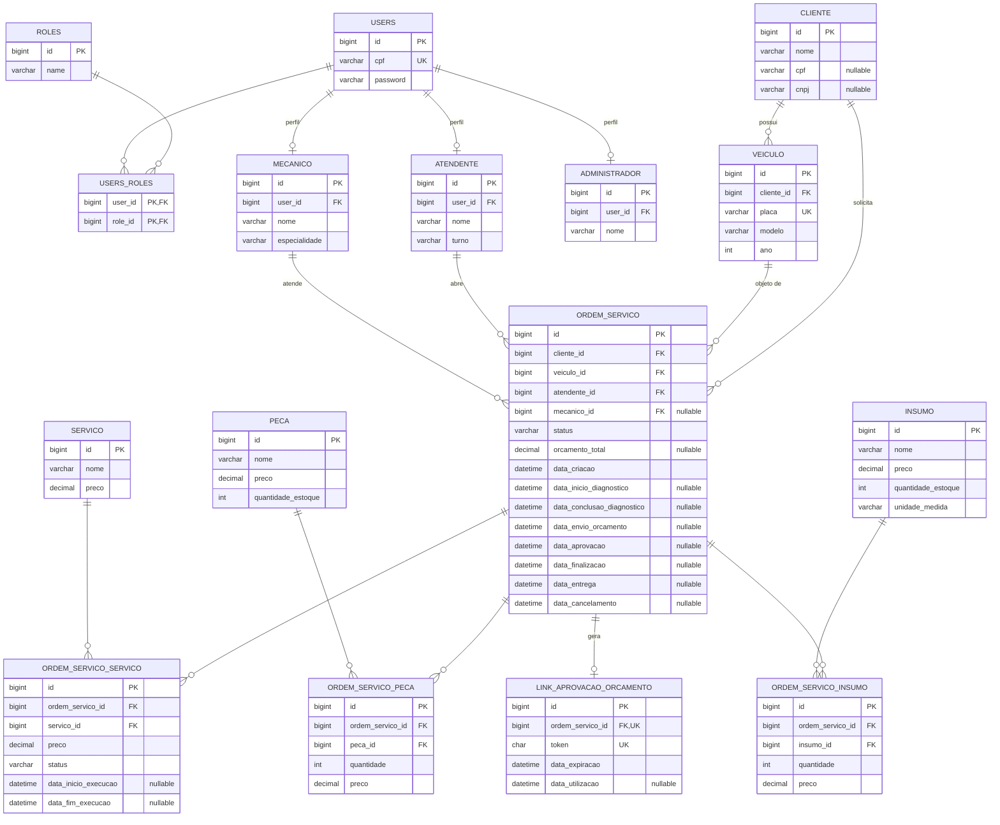

# Banco de Dados — Mecânica FIAP (Fase 3)

Justificativa da escolha do banco, o modelo relacional e a explicação dos relacionamentos.

## Escolha do banco: MySQL gerenciado (Amazon RDS)

### Por que um banco relacional

O domínio é **fortemente relacional e transacional**: `cliente → veículo → ordem de serviço →
(serviços, peças, insumos)`, com integridade referencial entre todas as pontas e regras de
unicidade (placa do veículo, CPF de usuário, um vínculo por item em cada ordem). Abrir uma ordem
de serviço executa vários `INSERT` mais a baixa de estoque numa única unidade de trabalho — precisa
de **transações ACID**. Não há requisito de escala horizontal massiva, schema dinâmico nem dados
semiestruturados que justificassem um banco NoSQL.

### Por que MySQL

| Critério | MySQL |
|---|---|
| Serviço gerenciado barato na AWS | RDS `db.t3.micro`, dentro do free tier / conta Academy Lab |
| Integração com a stack | suporte first-class no Spring Data JPA e no Flyway; driver `mysql-connector-j` maduro |
| Precisão temporal | `datetime(6)` (microssegundos) — usado nas datas de fase da ordem de serviço |
| Operação | backups automáticos, criptografia em repouso, patching gerenciado pelo RDS |

**Alternativas consideradas:** PostgreSQL — igualmente adequado; a decisão foi por familiaridade
da equipe e menor footprint na instância pequena. SQL Server — descartado pelo modelo de
licenciamento. O código **não usa nada específico de MySQL** além de tipos SQL padrão: migrar para
PostgreSQL seria trocar dialeto do Hibernate + driver, sem mudança de schema.

### Onde roda

RDS MySQL 8.0, privado (`publicly_accessible = false`), criptografado, na VPC do cluster EKS. O
security group libera a porta `3306` **apenas** para o security group do control plane do EKS — o
banco não é acessível pela internet nem pela Lambda de autenticação. Provisionado pelo repositório
[`fiap-mecanica-infra-db`](https://github.com/ArthurPeruzzo/fiap-mecanica-infra-db). Schema versionado
por Flyway (`src/main/resources/db/migration`), aplicado no startup da aplicação.

## Diagrama Entidade-Relacionamento

## Relacionamentos

### Segurança e perfis

- **`users` N:N `roles`** pela tabela de junção `users_roles` (PK composta `user_id + role_id`).
  Perfis: `ROLE_ATENDENTE`, `ROLE_MECANICO`, `ROLE_ADMINISTRADOR` (seed em `V1`) e `ROLE_CLIENTE`
  (`V16`).
- **`mecanico` / `atendente` / `administrador` → `users`** (N:1 via `user_id NOT NULL`; na
  prática 1:1). Cada perfil funcional é um registro próprio com dados de RH (nome, turno,
  especialidade) apontando para o `users` que autentica.
- **`cliente` NÃO tem FK para `users`.** O cliente é modelado só como parte de negócio. Quando
  ele se autentica pela Lambda (por CPF), a aplicação cria sob demanda um `users` com o mesmo CPF
  e `ROLE_CLIENTE` — a ligação entre `cliente` e `users` é **pelo valor do CPF**, não por chave
  estrangeira. É uma simplificação consciente: cliente não faz login por senha, e a `users` só
  existe para o `sub` do JWT.

### Cadastro

- **`cliente` 1:N `veiculo`** (`veiculo.cliente_id NOT NULL`). `veiculo.placa` é `UNIQUE`
  (identificador natural). O vínculo veículo↔cliente é imutável após a criação.
- **`cliente`** aceita **CPF ou CNPJ**, ambos `NULL` no schema — pessoa física ou jurídica sem
  tabela separada. A regra "exatamente um dos dois" é validada no domínio (`@DocumentoValido`),
  não pelo banco.
- **`peca`** e **`insumo`** são tabelas **separadas** (persistência table-per-concrete-class dos
  tipos `Peca`/`Insumo extends ItemEstoque`). `insumo` tem `unidade_medida`; `peca` não.

### Ordem de serviço

- **`ordem_servico` N:1** com `cliente`, `veiculo`, `atendente` (todas `NOT NULL`) e com
  `mecanico` (**`mecanico_id` NULL**). A ordem nasce sem mecânico (status `RECEBIDA`); o mecânico
  que inicia o diagnóstico assume a ordem e passa a ser o responsável.
- Os **8 timestamps de fase** (`data_inicio_diagnostico` … `data_entrega`, `data_cancelamento`)
  ficam como colunas na própria `ordem_servico`, não numa tabela de histórico de status — o ciclo
  de vida é linear e curto e cada transição ocorre no máximo uma vez. `orcamento_total` é
  calculado ao concluir o diagnóstico.
- **`ordem_servico` N:N `servico` / `peca` / `insumo`** pelas tabelas de junção
  `ordem_servico_servico`, `ordem_servico_peca`, `ordem_servico_insumo`. São junções **com
  atributos próprios**:
  - `preco` — *snapshot* do preço no momento do vínculo, para o orçamento não mudar se o catálogo
    for reajustado depois;
  - `quantidade` — em `ordem_servico_peca` / `ordem_servico_insumo`;
  - `status` (`NAO_INICIADO` / `EM_EXECUCAO` / `FINALIZADO`) + `data_inicio_execucao` /
    `data_fim_execucao` — em `ordem_servico_servico`, porque cada serviço da ordem evolui
    individualmente.
  - `UNIQUE (ordem_servico_id, <item>_id)` em cada junção impede vínculo duplicado no nível do
    banco — o domínio soma a quantidade em vez de inserir uma segunda linha.
- **`ordem_servico` 1:1 `link_aprovacao_orcamento`** (`ordem_servico_id` e `token` ambos
  `UNIQUE`). Tabela separada por ter ciclo de vida próprio: token UUID gerado ao enviar o
  orçamento, expira em 3 dias, uso único (o cliente aprova/recusa por link, sem autenticar).
