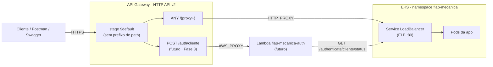

# API Gateway — fiap-mecanica (Terraform)

Provisiona o **AWS API Gateway HTTP API (v2)** que serve de porta de entrada da aplicação. Roteia
todo o tráfego para o LoadBalancer do Service Kubernetes (`k8s/service.yaml`) via integração
`HTTP_PROXY`, e deixa o terreno preparado para a Function Lambda de autenticação
(`fiap-mecanica-lambda`) entrar como uma rota adicional, sem acoplamento.

## Fluxo (macro)



## Por que um root module separado

O state deste módulo (`tfstate/apigateway.tfstate`) é **independente** do state da infra principal
(`../aws`, `tfstate/terraform.tfstate`). Três motivos concretos:

1. **Ordem de dependência.** A integração precisa do hostname do ELB, que só existe depois do
   `k8s-deploy` — ou seja, depois do `terraform apply` do módulo `../aws`. No mesmo state, seria
   preciso aplicar o state inteiro (EKS + RDS + New Relic) **duas vezes por deploy** só para
   atualizar uma rota.
2. **Desacoplamento da Lambda.** Um `data "aws_lambda_function"` no state principal faria todo
   `plan`/`apply` falhar enquanto a Lambda não existisse — quebrando o CI em Pull Requests e
   impossibilitando um deploy do zero.
3. **Estabilidade da URL pública.** Um `terraform destroy` da infra principal não derruba o
   gateway, então a URL do `execute-api` sobrevive à recriação de VPC/EKS/RDS.

## Recursos criados

| Arquivo | Recurso | O que é |
|---|---|---|
| `main.tf` | `aws_apigatewayv2_api.gateway` | HTTP API `fiap-mecanica-api` |
| `main.tf` | `aws_apigatewayv2_stage.default` | Stage `$default` com `auto_deploy` — ver "Por que `$default`" abaixo |
| `main.tf` | `aws_apigatewayv2_integration.app` | Integração `HTTP_PROXY` → `http://<app_elb_host>/{proxy}`, timeout 30s. Criada só quando `app_elb_host != ""` |
| `main.tf` | `aws_apigatewayv2_route.app_proxy` | Rota `ANY /{proxy+}`. Criada só quando `app_elb_host != ""` |
| `backend.tf` | — | Backend `s3` (bucket `fiap-mecanica`, `tfstate/apigateway.tfstate`). O bucket é criado por `../aws/bucket.tf` — sem bootstrap próprio |
| `providers.tf` | — | Provider `aws` (`us-east-1`). O provider `newrelic` **não** é replicado aqui |

## Por que o stage `$default`

Com `$default` a URL fica `https://<id>.execute-api.us-east-1.amazonaws.com/<path>`, **sem
prefixo**. Um stage nomeado (ex.: `prod`) entregaria `/prod/ordem-servico/...` ao backend; nenhum
matcher do `SecurityConfiguration` casaria e **tudo cairia em `anyRequest().denyAll()` → 403**. O
Swagger (`/swagger-ui/**`, `/v3/api-docs/**`) quebraria pelo mesmo motivo. `auto_deploy = true`
ainda dispensa o `aws_apigatewayv2_deployment`.

## Variáveis (`vars.tf`)

| Variável | Default | Descrição |
|---|---|---|
| `project_name` | `fiap-mecanica` | Prefixo do nome dos recursos |
| `region_default` | `us-east-1` | Região AWS |
| `tags` | `{Name = "fiap-mecanica-terraform"}` | Tags aplicadas aos recursos |
| `app_elb_host` | `""` | Hostname do ELB do Service K8s, sem esquema e sem barra final. Vazio ⇒ a rota da app não é criada e o gateway responde 404 em tudo |
| `auth_lambda_name` | `""` | Nome da Lambda de autenticação. Ainda não consumido — reservado para a Fase 3 |

Os defaults vazios são deliberados: permitem `terraform plan` no CI (em Pull Request não existe
ELB) e permitem criar o gateway numa infra do zero, antes do primeiro deploy no Kubernetes.

## Outputs (`output.tf`)

| Output | Uso |
|---|---|
| `api_gateway_url` | URL pública do gateway. Consumida pelo `cd.yml` para montar `URL_APROVAR_ORCAMENTO`/`URL_RECUSAR_ORCAMENTO` |
| `api_gateway_id` | ID da API — para montar a URL e consultar logs/métricas no CloudWatch |

## Ordem de deploy

O `cd.yml` já garante a ordem via `needs`:

```
terraform-apply (VPC/EKS/RDS/ECR)
  └─> docker-build-push
        └─> k8s-deploy   (cria o Service; o ELB ganha hostname)
              └─> apigw-apply   (recebe o hostname via TF_VAR_app_elb_host)
```

Manualmente:

```bash
ELB=$(kubectl get svc fiap-mecanica -n fiap-mecanica \
      -o jsonpath='{.status.loadBalancer.ingress[0].hostname}')

cd infra/terraform/apigateway
terraform init
terraform apply -var app_elb_host="$ELB"

API=$(terraform output -raw api_gateway_url)
curl -i -X POST "$API/authenticate/login" \
  -H 'Content-Type: application/json' \
  -d '{"cpf":"22255588846","senha":"MeCanica2026!@#"}'
```

Aplicar antes do Service existir cria o gateway **sem rotas** (404 em tudo). Não é erro: basta
reaplicar depois passando `-var app_elb_host=...`.

## Limitações conhecidas

- **O gateway pode ser contornado.** O ELB do Service continua público, então
  `http://<elb-host>/...` responde direto, sem passar pelo gateway. Fechar isso exigiria um NLB
  interno + `aws_apigatewayv2_vpc_link`, o que colide com a VPC só-de-subnets-públicas
  (`../aws/subnet.tf`) e com permissões incertas da conta AWS Academy Lab. Aceito
  conscientemente no escopo deste projeto.
- **O Swagger gera URLs apontando para o ELB.** Em `HTTP_PROXY` o API Gateway envia ao backend o
  header `Host` do **alvo** (o ELB), não o do `execute-api`. O springdoc monta os `servers` do
  `/v3/api-docs` a partir desse `Host`, então o "Try it out" dispara contra o ELB. Cosmético, sem
  impacto funcional. Correção, se incomodar: `springdoc.server-base-url` ou
  `server.forward-headers-strategy=FRAMEWORK`.
- **Sem access logs.** `access_log_settings` no stage exige `logs:CreateLogDelivery`, permissão
  não confirmada na conta do Lab. Deixado de fora para não confundir uma falha de permissão de
  log com uma falha do gateway; é um incremento isolado quando houver necessidade.
- **Timeout de 30s.** É o teto do HTTP API, não é configurável para além disso. Relevante no cold
  start da JVM logo após um rollout.
- **Sem domínio próprio.** A URL do `execute-api` já é estável (depende só do ID da API, que não
  muda quando o ELB é recriado) e já traz TLS válido — o ELB, por contraste, é HTTP puro na porta
  80. Um domínio custaria hosted zone Route 53 + registro + certificado ACM, com `route53:*`/ACM
  sendo permissões incertas no Lab. Se virar requisito, é aditivo:
  `aws_apigatewayv2_domain_name` + `aws_apigatewayv2_api_mapping`.

## Fase 3 — entrada da Lambda (ainda não implementado)

Quando a Lambda `fiap-mecanica-auth` existir, o acréscimo é **aditivo**, sem tocar em nada do que
está aqui hoje:

```hcl
data "aws_lambda_function" "auth" {
  count         = var.auth_lambda_name != "" ? 1 : 0
  function_name = var.auth_lambda_name
}

resource "aws_apigatewayv2_integration" "auth" {
  count                  = var.auth_lambda_name != "" ? 1 : 0
  integration_type       = "AWS_PROXY"
  integration_uri        = data.aws_lambda_function.auth[0].invoke_arn
  payload_format_version = "1.0"  # o handler espera APIGatewayProxyEvent
}

resource "aws_apigatewayv2_route" "auth" {
  count     = var.auth_lambda_name != "" ? 1 : 0
  route_key = "POST /auth/cliente"
  # ...
}

resource "aws_lambda_permission" "apigw" {
  count = var.auth_lambda_name != "" ? 1 : 0
  # sem isso o gateway recebe 500 ao invocar a Lambda
}
```

`POST /auth/cliente` é mais específica que `ANY /{proxy+}`, e o HTTP API prioriza a rota mais
específica — as duas convivem sem conflito.

> ⚠️ **O JWT authorizer nativo do gateway não serve para este projeto.**
> `aws_apigatewayv2_authorizer` do tipo `JWT` só aceita **OIDC/JWKS (RS256 com issuer discovery)**.
> O contrato atual entre a app e a Lambda é **HS256 com segredo compartilhado**, que o gateway não
> tem como validar nativamente. Se a autorização precisar sair do app e ir para o gateway, as
> opções são (a) **Lambda authorizer** do tipo `REQUEST`, ou (b) migrar o projeto para RS256 +
> endpoint JWKS. Decidir isso **antes** de escrever a authorizer.
>
> Hoje a autorização continua 100% no app (`UserAuthenticationFilter`) e o gateway apenas roteia,
> repassando o header `Authorization` intacto.
