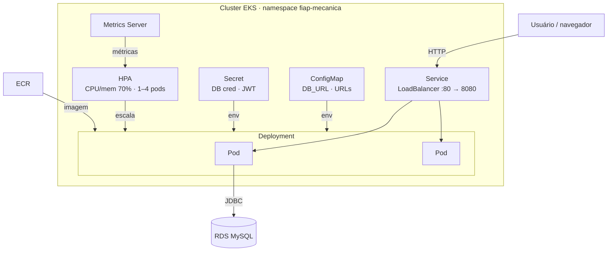

# Manifests Kubernetes — fiap-mecanica

Assume um cluster EKS já provisionado (`infra/terraform/aws/`) e o RDS MySQL já aplicado. A aplicação roda no cluster; o banco fica fora (RDS gerenciado).

## Fluxo (macro)



## Passo a passo

0. **Configurar o `kubectl` para falar com o cluster EKS** (uma vez por sessão de credenciais da AWS Academy Lab, que expiram):
   ```bash
   aws eks update-kubeconfig --name eks-fiap-mecanica --region us-east-1
   ```

1. **Build + push da imagem para o ECR**. O host do ECR inclui o *account ID* da conta AWS (muda se a conta da Lab for trocada), então em vez de fixá-lo, pegue a URL do repositório do output do Terraform:
   ```bash
   ECR=$(cd infra/terraform/aws && terraform output -raw ecr_repository_url)
   aws ecr get-login-password --region us-east-1 | docker login --username AWS --password-stdin "${ECR%/*}"
   docker build -t "$ECR:latest" .
   docker push "$ECR:latest"
   ```

2. **Preencher o `secret.yaml`** (nunca commitar — está no `.gitignore`):
   ```bash
   cp k8s/secret.yaml.example k8s/secret.yaml
   # editar k8s/secret.yaml com DB_USERNAME / DB_PASSWORD / JWT_SECRET reais
   ```

   Ajuste o `DB_URL` no `configmap.yaml` com o endpoint atual do RDS — ele **muda a cada recriação do banco**, por isso não fica fixado no repo. Pegue o valor atual com `terraform output -raw db_endpoint` (rodando em `infra/terraform/aws`).

3. **Aplicar tudo, nessa ordem exata** — `namespace.yaml` precisa existir antes de qualquer recurso namespaced ser criado nele:
   ```bash
   kubectl apply -f k8s/namespace.yaml
   kubectl apply -f k8s/metrics-server.yaml
   kubectl apply -f k8s/configmap.yaml -f k8s/secret.yaml
   kubectl apply -f k8s/deployment.yaml
   kubectl apply -f k8s/service.yaml
   kubectl apply -f k8s/hpa.yaml
   ```
   **Não use o atalho `kubectl apply -f k8s/`** num cluster do zero: ele processa os arquivos em ordem alfabética, e `configmap.yaml` viria antes de `namespace.yaml`, falhando porque o namespace ainda não existe. É por isso que o job `k8s-deploy` do pipeline (`.github/workflows/cd.yml`) também usa comandos explícitos nessa mesma ordem, não o atalho.

4. **Atualizar as URLs de orçamento** depois que o LoadBalancer subir:
   ```bash
   kubectl get svc fiap-mecanica -n fiap-mecanica
   # copiar o EXTERNAL-IP/hostname para URL_APROVAR_ORCAMENTO e URL_RECUSAR_ORCAMENTO
   # em k8s/configmap.yaml, depois:
   kubectl apply -f k8s/configmap.yaml
   kubectl rollout restart deployment/fiap-mecanica -n fiap-mecanica
   ```

   **Isso é só para o fluxo manual.** O job `k8s-deploy` do `cd.yml` não usa o `configmap.yaml` commitado — ele gera o ConfigMap dinamicamente: `DB_URL` a partir do output do Terraform (`terraform output db_endpoint`, capturado automaticamente no job anterior) e as URLs de orçamento a partir do hostname real do LoadBalancer, obtido via `kubectl get svc` com espera ativa (poll) logo após aplicar o `Service` — sem precisar de passo manual, e funcionando mesmo depois de um `terraform destroy`/`apply` que gere um RDS e um LoadBalancer novos.

## Metrics Server

`k8s/metrics-server.yaml` é uma cópia estática do manifest oficial do [kubernetes-sigs/metrics-server](https://github.com/kubernetes-sigs/metrics-server). Roda em `kube-system`, não no namespace `fiap-mecanica` — é um add-on do cluster, não da aplicação. Sem ele o HPA (`kubectl get hpa -n fiap-mecanica`) mostra `<unknown>` nos targets de CPU/memória e nunca escala. Para atualizar a versão, baixe novamente de:
```bash
curl -fsSL -o k8s/metrics-server.yaml https://github.com/kubernetes-sigs/metrics-server/releases/latest/download/components.yaml
```

## Arquivos

| Arquivo | O que é |
|---|---|
| `namespace.yaml` | Namespace `fiap-mecanica` |
| `configmap.yaml` | Config não sensível (DB_URL, URLs de orçamento) — referência para uso manual; o `cd.yml` gera o seu próprio ConfigMap dinamicamente, não aplica este arquivo |
| `secret.yaml.example` | Template do Secret (credenciais DB, JWT). Copiar para `secret.yaml` e preencher — não commitar |
| `deployment.yaml` | Deployment da app, probes de liveness/readiness via Actuator, requests/limits de CPU/memória |
| `service.yaml` | Service `LoadBalancer`, expõe a porta 80 → 8080 |
| `hpa.yaml` | HorizontalPodAutoscaler (CPU e memória, 70%, 1–4 réplicas) |
| `metrics-server.yaml` | Add-on de cluster necessário para o HPA funcionar no EKS |
